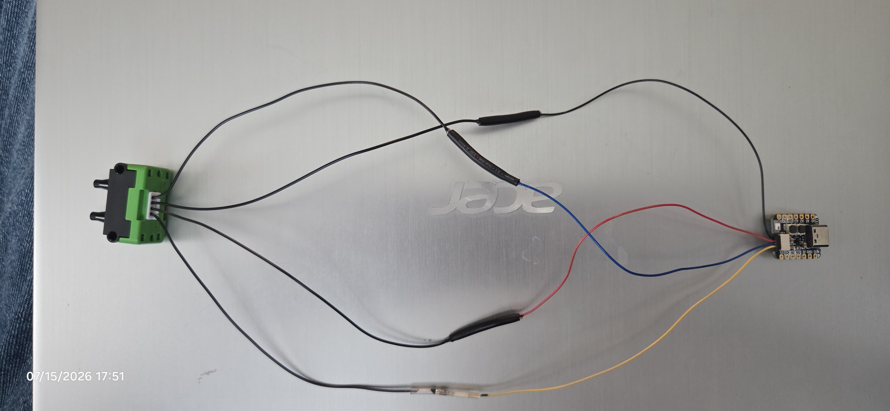
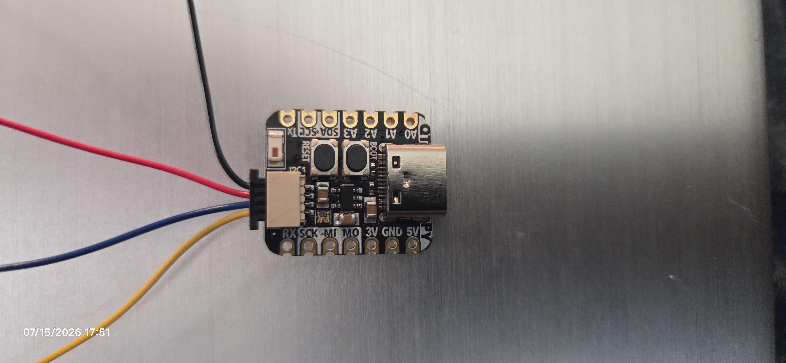
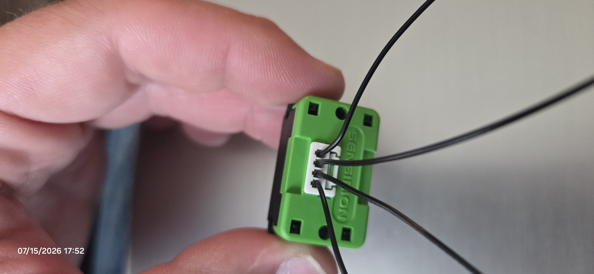

# Build a Radon Mitigation Vacuum Sensor with ESPHome and Home Assistant

A radon gas monitor tells you the *result* of your mitigation system
working (or not) — but it can take hours or days for radon levels to drift
back up after a fan fails. This project measures the actual suction the
fan is pulling at the pipe, in real time, so you find out immediately if
something's wrong instead of days later.

It's a small ESP32 board with a differential pressure sensor, reporting
into Home Assistant over WiFi via [ESPHome](https://esphome.io/). No
custom firmware code required — just a short YAML config.

Built with substantial help from Claude (Claude Code) for debugging and
configuration along the way.

---

## Bill of materials

| Part | Notes |
|---|---|
| Adafruit QT Py ESP32-S3 | PID 5426 — the "no PSRAM, 8MB flash" variant |
| Sensirion SDP811-500Pa | PN 3000144 — **not** the SDP810 (see gotcha below, different part, different I2C address) |
| Sensirion green cap adapter | Clip-on mount that holds the sensor's DuraClik connector |
| STEMMA QT cable | Connects the sensor side to the QT Py's STEMMA QT port |
| SDP811 DuraClik pigtail | Comes with/for the sensor; gets spliced to the STEMMA QT cable |
| Sensing hose | Length depends on your install; keep it as short as practical |
| USB-C cable | For flashing and power |
| Soldering iron, heat-shrink, multimeter | For the splice and for continuity-tracing wires (see below) |

## Wiring the sensor to the board

The SDP811 doesn't plug straight into a STEMMA QT cable — its DuraClik
pigtail has to be spliced to a STEMMA QT cable's wires. The DuraClik
connector pinout, with pin 1 marked by a molded "1" on the underside of
the sensor:

| DuraClik pin | Signal | Splice to STEMMA color |
|---|---|---|
| 1 | SCL | Yellow |
| 2 | VDD | Red |
| 3 | GND | Black |
| 4 | SDA | Blue |

> **Gotcha:** the DuraClik pigtail's wire insulation is all black — every
> conductor looks the same. Don't guess by position; trace continuity
> from each pigtail wire back to its pin with a multimeter before you
> splice, then label it.

> **Gotcha:** the QT Py ESP32-S3's STEMMA QT connector is a **second,
> separate I2C bus** — it is not wired to the board's labeled SDA/SCL
> pads. If you're bringing up I2C in code and nothing responds, check
> you're using the STEMMA bus (GPIO40 = SCL, GPIO41 = SDA on this board),
> not the pads.

Keep the sensor-to-board cable run short — Sensirion's engineering
guidance for this sensor is 20cm or less between sensor and MCU.





## Flashing the ESP32 with ESPHome, via Home Assistant

If you don't already have the **ESPHome Device Builder** add-on installed
in Home Assistant, install it from the Add-on Store first. It gives you a
web UI to write, compile, and OTA-flash ESPHome configs without needing a
local toolchain.

Create a new device in the add-on and use a config like this as your
starting point:

```yaml
esphome:
  name: radon-node1
  friendly_name: Radon Node 1

esp32:
  board: adafruit_qtpy_esp32s3_nopsram
  framework:
    type: esp-idf

logger:
  level: INFO

api:
  encryption:
    key: !secret api_encryption_key

ota:
  - platform: esphome

wifi:
  ssid: !secret wifi_ssid
  password: !secret wifi_password

i2c:
  sda: GPIO41
  scl: GPIO40
  scan: true
  frequency: 100kHz

sensor:
  - platform: sdp3x
    name: "Sub-slab Pressure"
    address: 0x26
    measurement_mode: differential_pressure
    update_interval: 60s
```

Put your own WiFi SSID/password and a generated API encryption key in the
add-on's `secrets.yaml` — nothing home-network-specific needs to go in the
device config itself beyond your own WiFi credentials.

> **Gotcha:** ESPHome's `sdp3x` component defaults to I2C address `0x21`.
> The SDP811 is at **0x26** — you have to set it explicitly, or the
> sensor won't be found.

> **Gotcha:** 0x25 is the SDP810. 0x26 is the SDP811. They're different
> parts with different addresses on purpose (per the Sensirion datasheet's
> ordering table) — if you're cross-referencing sensor docs, make sure
> you're reading the SDP811 section, not the SDP810 one.

> **Gotcha:** the QT Py ESP32-S3 is 2.4GHz WiFi only. Make sure the SSID
> you're pointing it at is a 2.4GHz network/band.

> **Note on units:** the sensor's native output is hPa; the config above
> reports raw Pa (no `device_class` set), so Home Assistant won't silently
> auto-convert the value to psi or another unit on you.

**First flash only:** connect via USB and put the board in its ROM
bootloader before flashing — hold the **BOOT** button, tap **RESET**,
then release BOOT. Every flash after that (including OTA once it's on
WiFi) resets automatically.

## Common pitfalls (quick reference)

- SDP811 I2C address is `0x26`, not the `sdp3x` default of `0x21` — set
  it explicitly.
- Don't confuse SDP810 (`0x25`) with SDP811 (`0x26`) — different parts.
- STEMMA QT on the QT Py ESP32-S3 is a second I2C bus (GPIO40/41), not the
  board's SDA/SCL pads.
- DuraClik pigtail wires are all black insulation — trace continuity,
  don't trust position or color.
- Keep the sensor-to-MCU cable ≤20cm.
- QT Py ESP32-S3 WiFi is 2.4GHz only.
- First flash needs the ROM bootloader (BOOT held, tap RESET, release);
  later flashes/OTA are automatic.
- Clear `device_class` on the sensor entity so Home Assistant reports raw
  Pa instead of converting units.

## Placement and mounting

The node just needs USB power and its sensing hose reaching a tap on your
mitigation pipe — there's no specific mounting method it requires. Put it
wherever's convenient and secure near the pipe.

As one example: I mounted mine in a network equipment rack, powered from
the rack's UPS (so it stays up during a power outage), with about two
feet of hose running to a tap on the mitigation pipe. That's just what I
had available — any powered, secure spot near the pipe works fine.

<!-- PHOTO: finished install example (rack mount, hose routing, sensor closeup) — to be added -->

## Reading the sensor / verifying it works

Before final install, do a **blow test**: gently blow into (or suck on)
the sensing hose and watch the entity's value in Home Assistant — you
should see a sharp spike that settles back down. That confirms the sensor
is alive and reporting.

Once plumbed to the mitigation pipe, watch the value with the fan running
vs. off. In our install, the reading moved more negative when the fan was
running. Sensirion doesn't document a fixed "this port is always
positive" convention for how you plumb it — which barb ends up reading
which sign depends on how you connect it, so do your own blow test (or
compare fan on/off) to confirm the direction for your setup rather than
assuming it matches this example.

## What's next

- **Fan-failure / low-suction alert** — not built yet. The natural next
  step is a Home Assistant automation that alerts if the reading drifts
  toward zero (loss of suction) while the fan should be running.
- This build uses a single node on one suction point. If your mitigation
  system has multiple branches, the same design could be repeated per
  branch — just watch the ≤20cm sensor-cable guidance if you're
  centralizing multiple sensors on one board.

## Glossary

- **I2C** — a two-wire (SDA/SCL) protocol many small sensors use to talk
  to a microcontroller.
- **STEMMA QT** — Adafruit's plug-and-play I2C connector standard; no
  soldering needed once you have the right cable.
- **Sub-slab depressurization** — the standard radon mitigation approach:
  a fan pulls air from under the foundation slab and vents it outside,
  keeping radon-bearing soil gas from entering the house.
- **ESPHome** — a tool for turning a YAML config into working ESP32/ESP8266
  firmware, tightly integrated with Home Assistant.
- **OTA** — "over the air" — updating a device's firmware over WiFi
  instead of a USB cable.

---

